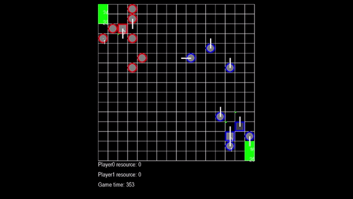

# NanoRTS
pure python version [microRTS](https://github.com/Farama-Foundation/MicroRTS.git). Almost the same as [microRTS](https://github.com/Farama-Foundation/MicroRTS.git).
### Exmaple Code
```python
from nanorts.game_env import GameEnv
from ais.nano_rts_ai import RushAI
from nanorts.render import Render
if __name__ == "__main__":
    rewards_wrights = {'win': 10, 'harvest': 1, 'return': 1, 'produce': 1, 'attack': 1}
    num_envs = 1
    map_paths = ['maps\\16x16\\basesWorkers16x16.xml' for _ in range(num_envs)]
    max_steps=5000
    env = GameEnv(map_paths, rewards_wrights, max_steps)
    width = 16
    height = 16
    ai0 = RushAI(0, "Random", width, height)
    ai1 = RushAI(1, "Light", width, height)
    r = Render(16,16)
    for _ in range(100000):
        r.draw(env.games[0])
        game = env.games[0]
        # action: Action(unit_pos:int, action_type:str, target_pos:int, produced_unit_type:UnitType=None)
        action0 = ai0.get_action(game)
        action1 = ai1.get_action(game)
        #action_lists: List[List[Action]]
        states, rewards, dones, winners = env.one_game_step(action0, action1)
```
### nanoRTS demo


### compare with micorrts


